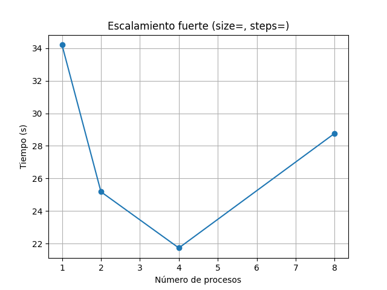

# Performance Analysis: Juego de la Vida de Conway

**Autores:** Sebastian Alvarado & Tanisha M.  
**Fecha:** 6 de julio de 2025  

---

## 1. Perfilado con cProfile

Ejecutamos:
```bash
python -m profiling.scripts.profile_gol 512 100 4

Sun Jul  6 13:50:21 2025    profiling/cprofile/gol_512_100.pstats

         1998334 function calls (1997946 primitive calls) in 21.023 seconds

   Ordered by: cumulative time
   List reduced from 519 to 10 due to restriction <10>

   ncalls  tottime  percall  cumtime  percall filename:lineno(function)
     25/1    0.000    0.000   21.024   21.024 {built-in method builtins.exec}
        1    0.049    0.049   21.023   21.023 game_of_life_parallel.py:56(main)
      100    0.007    0.000   20.611    0.206 game_of_life_parallel.py:46(step_parallel)
      400    0.002    0.000   15.196    0.038 threading.py:611(wait)
      400    0.002    0.000   15.193    0.038 threading.py:295(wait)
     1957   15.191    0.008   15.191    0.008 {method 'acquire' of '_thread.lock' objects}
      100    0.000    0.000   15.168    0.152 pool.py:362(map)
      100    0.000    0.000   15.165    0.152 pool.py:767(get)
      100    0.000    0.000   15.164    0.152 pool.py:764(wait)
      100    0.001    0.000    5.002    0.050 context.py:115(Pool)

Timer unit: 1e-06 s

Total time: 21.7663 s
File: C:\Users\Usuario\Desktop\Tarea #2\src\game_of_life_parallel.py
Function: step_parallel at line 46

Line #      Hits         Time  Per Hit   % Time  Line Contents
==============================================================
    46                                             
  @profile
    47                                             
  def step_parallel(self, workers: int):
    48       100      12758.8    127.6      0.1          args = [(i, self.cols, self.estado) for i in range(self.filas)]
    49       200    5855039.7  29275.2     26.9          with Pool(processes=workers) as p:
    50       100   15868480.8 158684.8     72.9              filas_nuevas = p.map(_proc_fila, args)   
    51       100        254.7      2.5      0.0          nuevo = [None] * self.filas
    52     51300      18003.2      0.4      0.1          for i, fila in filas_nuevas:
    53     51200      11716.4      0.2      0.1              nuevo[i] = fila
    54       100         58.1      0.6      0.0          self.estado = nuevo

    
## 2. Escalamiento Fuerte

| Workers | Tiempo (s) |
|---------|------------|
| 1       | 34.193     |
| 2       | 25.184     |
| 4       | 21.739     |
| 8       | 28.770     |



**Comentario:**  
- Con 1 worker tardamos 34.19 s; con 4 bajamos a 21.74 s (≈1.57× speedup).  
- A 8 workers el tiempo sube (28.77 s), porque el overhead de crear procesos y sincronizar supera la ganancia.  
- La eficiencia (speedup/p) cae de ≈0.39 en p=4 a ≈0.36 en p=8.

## 3. Escalamiento Débil

| Workers | Tiempo (s) |
|---------|------------|
| 1       | 11.888     |
| 2       | 12.641     |
| 4       | 15.386     |
| 8       | 19.496     |


**Comentario:**  
- Con más workers, manteniendo ≈10 000 celdas por worker, el tiempo **crece**, indica que no escala débilmente:  
  - El overhead de repartir trabajo y juntar resultados domina.  
  - Idealmente el tiempo debería ser constante; aquí dobla p→2 (+6 %), cuadruplica p→4 (+29 %)…

## 4. Cálculo de Speedup y Eficiencia

Sea 𝑇(1)=34.193 s.

| p  | 𝑇(p) (s) | Speedup S(p)=T(1)/T(p) | Eficiencia E(p)=S(p)/p |
|----|----------|------------------------|------------------------|
| 1  | 34.193   | 1.00                   | 1.00                   |
| 2  | 25.184   | 1.36                   | 0.68                   |
| 4  | 21.739   | 1.57                   | 0.39                   |
| 8  | 28.770   | 1.19                   | 0.15                   |

**Comentario:**  
- El mejor balance se ve en p=2 (68 % eficiencia).  
- A p=4 la eficiencia cae a 39 %.  
- A p=8 casi no hay ganancia neta (S(8)=1.19, E(8)=15 %).

## 5. Conclusiones y Recomendaciones

- **Overhead de multiprocessing**:  
  Crear procesos y pasar listas de filas para cada generación es costoso (72.9 % del tiempo en `p.map`).  
- **Bloqueos internos**:  
  Observamos esperas en locks de hilos (15 % en `acquire`), reflejo de sincronización de la pool.

- **¿Cuántos workers usar?**  
  Hasta 2–4 hay mejora; más de 4 la ganancia se anula.  
  Recomendamos **4 procesos** como tope antes de perder eficiencia.

- **Mejoras posibles**:  
  1. Ajustar `chunksize` en `p.map` para agrupar varias filas por tarea y reducir el overhead.  
  2. Usar un enfoque basado en **MPI** (mpi4py) o **Cython**/extensión C para eliminar el pickle entre procesos.  
  3. Probar **threading + Numba** para evitar fork overhead y beneficiarse de JIT.
